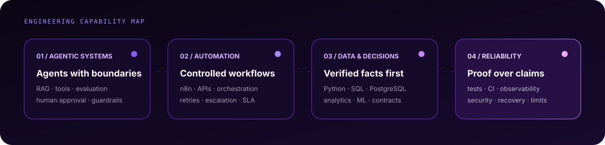

## Engineering reliable AI systems

I design AI agents, automation systems, and data-driven workflows where **business rules, evidence, and reliable execution** matter as much as model capability.

My focus is the engineering layer between a promising demo and a dependable system: data contracts, orchestration, evaluation, bounded tool use, human approval, security, recovery, and honest documentation of what has actually been tested.

## Selected command systems

| System | Mission | Evidence signal |
|---|---|---|
| **[Applied Agentic Systems](https://github.com/kooroosh1363/applied-agentic-systems)** | Business-process agents with state, SLA handling, recovery paths, and local adapters | Implemented work is separated from roadmap claims; deterministic validation and Docker paths |
| **[Evidence-First Data-to-Text Agent](https://github.com/kooroosh1363/llm-data-to-text-agent)** | Local CSV/JSON-to-Markdown reporting with deterministic KPI calculation and optional local Ollama wording | 24 tests · Python 3.11–3.13 CI · no paid API required |
| **[Agentic Automation Lab](https://github.com/kooroosh1363/agentic-automation-lab)** | Progressive systems across workflow automation, RAG, multi-agent orchestration, data engineering, and n8n infrastructure | Importable artifacts · project-level documentation · explicit maturity labels |
| **[Supply Chain Inventory Analytics](https://github.com/kooroosh1363/supply-chain-inventory-analytics)** | Defensible SKU prioritization using real UCI logistics data without inventing unavailable inventory fields | Strict schema and domain checks · 12 tests · offline CI plus live-source validation |

<strong>More verified data and analytics work</strong>

 

| Project | Engineering focus |
|---|---|
| [E-commerce SQL Business Analytics](https://github.com/kooroosh1363/ecommerce-sql-business-analytics) | PostgreSQL KPIs, RFM, cohorts, profitability, reconciliation, and query performance |
| [Customer Behavior Analytics](https://github.com/kooroosh1363/customer-behavior-analytics) | Reproducible customer lifecycle, retention, acquisition quality, pytest, and CI |

## Technical control stack

| Layer | Tools and practices |
|---|---|
| **Agentic systems** | LLM workflows · RAG · tool calling · evaluation · human-in-the-loop controls · local/mock providers |
| **Automation** | n8n · FastAPI · REST APIs · orchestration · retries · escalation · failure recovery |
| **Data and ML** | Python · SQL · Pandas · NumPy · PostgreSQL · Scikit-learn · XGBoost · SHAP |
| **Engineering** | Docker · GitHub Actions · testing · data contracts · observability · security boundaries |

## Operating principles

1. **Compute and validate facts before asking a model to explain them.**
2. **Keep the default path reproducible and free of paid-service dependencies.**
3. **Mark synthetic, simulated, and real-provider evidence clearly.**
4. **Treat tests, failure paths, security boundaries, and limitations as part of the product.**
5. **Use production-oriented language only for patterns that are actually demonstrated.**

### Data → Verified Facts → Decisions → Controlled Automation

Open to work on AI agents, automation platforms, and data systems where reliability is part of the product.

[**Connect on LinkedIn**](https://www.linkedin.com/in/peyman-radmanesh/) · [**Explore the repositories**](https://github.com/kooroosh1363?tab=repositories) · [**View Kaggle**](https://www.kaggle.com/peymanradmanesh)

Designed as a recruiter-first command center: restrained motion, explicit evidence, no inflated deployment claims.

