<strong>Accessible portfolio summary and project links</strong>

 

I build testable AI agents, automation systems, and data-driven workflows that turn verified facts and business rules into controlled actions.

| Selected system | Evidence |
|---|---|
| [Applied Agentic Systems](https://github.com/kooroosh1363/applied-agentic-systems) | State, SLA handling, recovery paths, local adapters, deterministic validation, and Docker paths |
| [Evidence-First Data-to-Text Agent](https://github.com/kooroosh1363/llm-data-to-text-agent) | Deterministic KPI calculation, 24 tests, Python 3.11–3.13 CI, and no paid API requirement |
| [Agentic Automation Lab](https://github.com/kooroosh1363/agentic-automation-lab) | RAG, multi-agent orchestration, n8n infrastructure, importable artifacts, and maturity labels |
| [Supply Chain Inventory Analytics](https://github.com/kooroosh1363/supply-chain-inventory-analytics) | Real UCI data, strict schema checks, 12 tests, and live-source validation |

**Core stack:** Python · SQL · PostgreSQL · n8n · FastAPI · Docker · GitHub Actions · RAG · testing · observability

